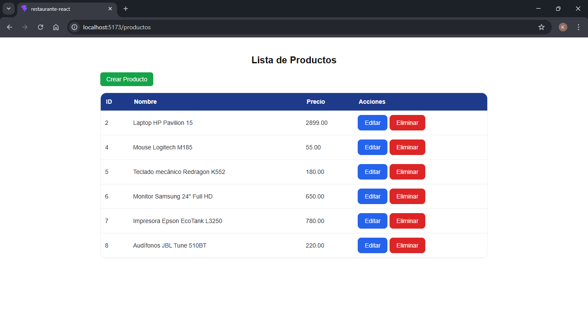
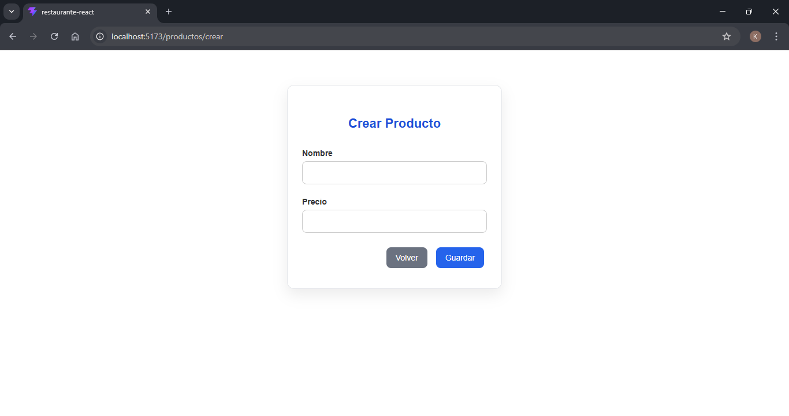
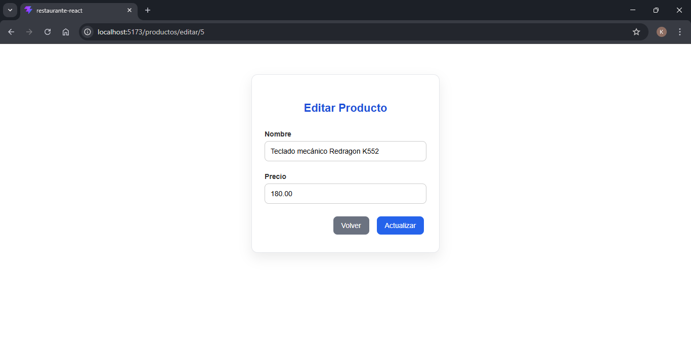

# Sistema de Gestión de Productos

Aplicación web full stack desarrollada con React (frontend) y Laravel (backend), que permite la gestión de productos mediante operaciones CRUD consumiendo una API REST y utilizando MySQL como base de datos.

---

## Funcionalidades

- Crear productos  
- Listar productos  
- Editar productos  

---

## Tecnologías utilizadas

- React  
- Laravel  
- PHP  
- MySQL  
- JavaScript  
- API REST  

---

## Arquitectura del sistema

Frontend (React) → API REST (Laravel) → Base de datos (MySQL)

---

## Instalación y ejecución

### Clonar el proyecto

git clone https://github.com/kenjyo/sistema-gestion-productos.git  
cd repo  

---

### Backend (Laravel)

composer install  
cp .env.example .env  

Configurar base de datos en `.env`:

DB_DATABASE=sistema_productos  
DB_USERNAME=root  
DB_PASSWORD=  

Luego ejecutar:

php artisan key:generate  
php artisan migrate  
php artisan serve  

---

### Frontend (React)

cd app-productos  
npm install  
npm run dev  

---

## API Endpoints

- GET /products → listar productos  
- GET /products/{id} → obtener producto  
- POST /products → crear producto  
- PUT /products/{id} → actualizar producto  
- DELETE /products/{id} → eliminar producto  

---

## Capturas del sistema

### Lista de productos

### Crear producto

### Editar producto

---

## Notas

- El proyecto requiere MySQL en ejecución antes de ejecutar migraciones  
- El archivo `.env` debe configurarse manualmente después de clonar el repositorio  

---

## Autor

Kenjyo Huancahuire  
GitHub: https://github.com/kenjyo/sistema-gestion-productos
